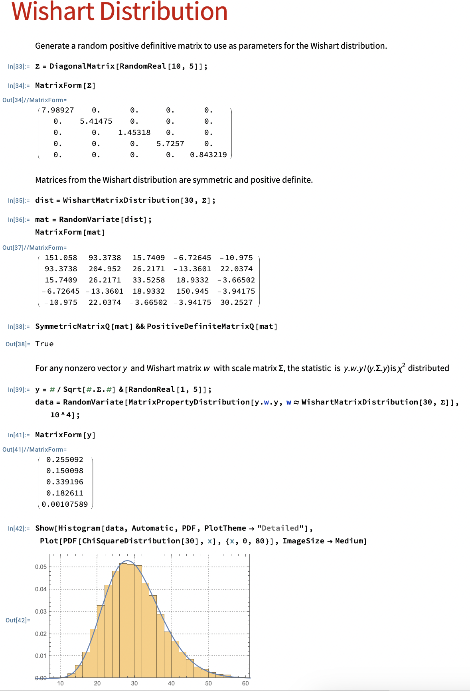
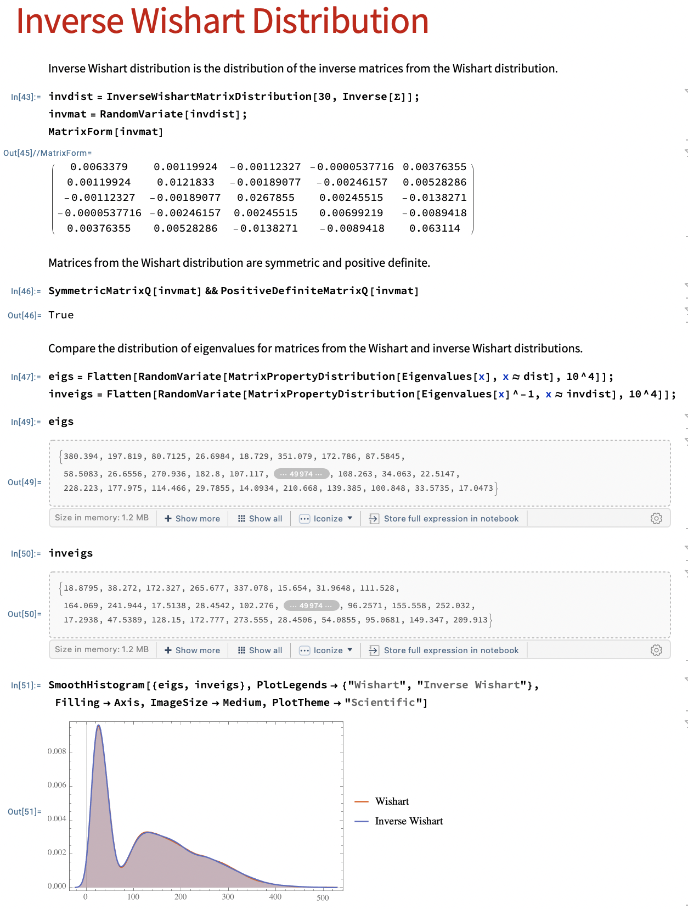

# Castelletti and Peluso (2022). Network Structure Learning Under Uncertain Interventions

## Summary

This paper presents a Bayesian statistical methodology for learning the dependence structure and intervention targets in a network of variables. The method utilizes a Directed Acyclic Graph (DAG) model and a DAG-Wishart prior on the DAG parameters. It also incorporates variable selection priors to express uncertainty on the intervention targets. The authors provide theoretical results on the identification of intervention targets and the consistency of the graph structure.

To approximate the posterior distribution over the space of DAGs and intervention targets, the paper proposes a Markov chain Monte Carlo (MCMC) algorithm. The performance of the method is evaluated through simulation studies and real data analysis. The results demonstrate that the proposed method outperforms other benchmark methods in terms of target identification and DAG recovery.

The authors apply their methodology to genomic data collected under various drug treatments, revealing insights into gene dependencies and the effects of different drug therapies. They also discuss potential applications of their methodology in the study of brain networks and functional Magnetic Resonance Imaging (fMRI) activations.

## Contributions

1. we build a new modelling framework where observational data are not strictly required, the excessive reliance on multiple tests is avoided, and unknown interventions are represented as indicator vector parameters, rather than auxiliary nodes that increase the graph dimension; 
   
2. we demonstrate theoretically, and validate empirically, the correct asymptotic identification of the targets and of the equivalence class of the true DAG; 
   
3. we propose a novel MCMC algorithm for joint posterior analysis over the space of graphs and interventions, without resorting to optimization routines. In addition, we emphasize that our method is practically feasible on graphs of dimension larger than those studied so far in the Bayesian literature, without imposing restrictive assumptions on the structure of the interventions. 
   
4. Finally, differently from other Bayesian approaches for DAG structure learning, our method revolves around arbitrary DAGs, that is, with completely unknown ordering of the nodes; see Ni, Stingo, and Baladandayuthapani (2017, 2019) for a comparison.

## Model: Gaussian DAG

### Choice of Priors

#### Wishart Distribution
The prior chosen to estimate the DAG follows a **Wishart distribution** with a hyperparameter $U$ and shape hyperparameter $a_D$.

Let $X$ be a $p \times p$ symmetric matrix of random variables that is positive semi-definite. Let $V$ be a (fixed) symmetric positive definite matrix of size $p \times p$.

Then, if $n \ge p$, $X$ has a Wishart distribution with $n$ degrees of freedom if it has the probability density function

$$ f_X(X) = \frac{1}{2^{np/2} |V|^{n/2} \Gamma_p \left( \frac{n}{2}\right) } |X|^{(n-p-1)/2} e^{-\frac{1}{2}tr(V^{-1} - X)}  $$

where $X$ is a determinant of $X$ and $\Gamma_p$ is the multivariate gamma function defined as

$$ \Gamma_p \left( \frac{n}{2} \right) = \pi^{p(p - 1)/4} \prod_{j=1}^p \Gamma \left( \frac{n}{2} - \frac{j-1}{2} \right) $$

**Expected Value**
$$E[ W_p(V,n)] = nV$$
suggesting that a reasonable choice for $V$ would be $n^{-1} \Sigma_0^{-1}$, where $\Sigma_0$ is some prior guess for the covariance matrix

#### Beta Distribution

The prior on the collection of interventional parameters is assigned as $p(h_k | \pi_k)$, where $h_k$ represents the indicator vector for the k-th intervention target and π_k follows a Beta distribution with hyperparameters $a_k$ and $b_k$.

The choice of $a_D = (a_{D1}, ..., a_{Dq})$ is made such that $a_Dj = (a - q + 1)/2 and b_Dj = g/2$, where a and g are elicited parameters.
