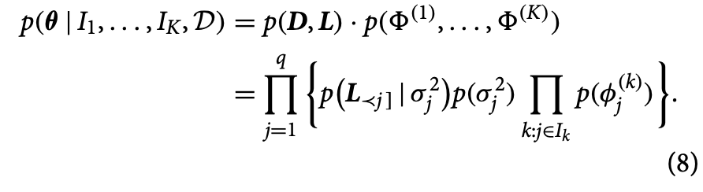

# Castelletti and Peluso (2022). Network Structure Learning Under Uncertain Interventions

 [Paper Source Code (in R)](https://github.com/FedeCastelletti/bayes_learning_networks_interventional)

## Summary

This paper presents a Bayesian statistical methodology for learning the dependence structure and intervention targets in a network of variables. The method utilizes a Directed Acyclic Graph (DAG) model and a DAG-Wishart prior on the DAG parameters. It also incorporates variable selection priors to express uncertainty on the intervention targets. The authors provide theoretical results on the identification of intervention targets and the consistency of the graph structure.

To approximate the posterior distribution over the space of DAGs and intervention targets, the paper proposes a Markov chain Monte Carlo (MCMC) algorithm. The performance of the method is evaluated through simulation studies and real data analysis. The results demonstrate that the proposed method outperforms other benchmark methods in terms of target identification and DAG recovery.

The authors apply their methodology to genomic data collected under various drug treatments, revealing insights into gene dependencies and the effects of different drug therapies. They also discuss potential applications of their methodology in the study of brain networks and functional Magnetic Resonance Imaging (fMRI) activations.

## Contributions

1. we build a new modelling framework where observational data are not strictly required, the excessive reliance on multiple tests is avoided, and unknown interventions are represented as indicator vector parameters, rather than auxiliary nodes that increase the graph dimension; 
   
2. we demonstrate theoretically, and validate empirically, the correct asymptotic identification of the targets and of the equivalence class of the true DAG; 
   
3. we propose a novel MCMC algorithm for joint posterior analysis over the space of graphs and interventions, without resorting to optimization routines. In addition, we emphasize that our method is practically feasible on graphs of dimension larger than those studied so far in the Bayesian literature, without imposing restrictive assumptions on the structure of the interventions. 
   
4. Finally, differently from other Bayesian approaches for DAG structure learning, our method revolves around arbitrary DAGs, that is, with completely unknown ordering of the nodes; see Ni, Stingo, and Baladandayuthapani (2017, 2019) for a comparison.

## Model: Gaussian DAG

### Choice of Priors

#### Prior on DAG: Wishart Distribution
The prior chosen to estimate the DAG follows a **Wishart distribution** with a hyperparameter $U$ and shape hyperparameter $a_D$.

Let $X$ be a $p \times p$ symmetric matrix of random variables that is positive semi-definite. Let $V$ be a (fixed) symmetric positive definite matrix of size $p \times p$.

Then, if $n \ge p$, $X$ has a Wishart distribution with $n$ degrees of freedom if it has the probability density function

$$ f_X(X) = \frac{1}{2^{np/2} |V|^{n/2} \Gamma_p \left( \frac{n}{2}\right) } |X|^{(n-p-1)/2} e^{-\frac{1}{2}tr(V^{-1} - X)}  $$

where $X$ is a determinant of $X$ and $\Gamma_p$ is the multivariate gamma function defined as

$$ \Gamma_p \left( \frac{n}{2} \right) = \pi^{p(p - 1)/4} \prod_{j=1}^p \Gamma \left( \frac{n}{2} - \frac{j-1}{2} \right) $$

**Expected Value**
$$E[ W_p(V,n)] = nV$$
suggesting that a reasonable choice for $V$ would be $n^{-1} \Sigma_0^{-1}$, where $\Sigma_0$ is some prior guess for the covariance matrix

#### Prior on DAG Parameter $\theta$: Inverse Gamma Distribution

Consider now the intervanetional parameters $\{ \Phi^{(k)}\}^K_{k=1}$, where each $\phi^{(k)}_j$ corresponds to an unconditional variance in a postintervention distribution where each node $j \in I_k$ has no parents, we can set

$$\phi^{(k)}_j \approx I-Ga(a^{(k)}_j, b^{(k)}_j),$$

independently, where $a^{(k)}_j = (a-q + 1)/2$ and $b^{(k)}_j = g/2$. 

The prior on the collection of interventional parameters is therefore $p(\Phi^{(1)}, ..., \Phi^{(K)}) = \prod_{k=1}^K \prod_{j \in I_k} p(\Phi^{(k)}_j)$, leading to the conditional prior on $\theta$ of the form

#### Prior on Targets $l_1, ..., l_k$: Beta Distribution

The prior on the collection of interventional parameters is assigned as $p(h_k | \pi_k)$, where $h_k$ represents the indicator vector for the k-th intervention target and π_k follows a Beta distribution with hyperparameters $a_k$ and $b_k$.

## MCMC Scheme and Posterior Inference

The proposed MCMC scheme for posterior inference on Directed Acyclic Graphs (DAGs) and intervention targets works as follows:

1. Initialize the MCMC algorithm by randomly selecting a DAG structure and intervention targets.

2. Generate a new proposal DAG structure by making local modifications to the current structure. This can involve adding or removing edges between nodes in the DAG.

3. Update the intervention targets by randomly selecting a subset of nodes in the DAG to be targeted by interventions.

4. Evaluate the acceptance probability for the proposed DAG structure and intervention targets. This is done by comparing the likelihood of the data under the proposed configuration with the likelihood under the current configuration.

5. Accept or reject the proposed configuration based on the acceptance probability. If the proposed configuration is accepted, update the current configuration to the proposed one. Otherwise, keep the current configuration unchanged.

6. Repeat steps 2-5 for a large number of iterations to explore the space of possible DAG structures and intervention targets.

7. After the MCMC iterations, obtain samples from the posterior distribution by retaining a subset of the configurations visited during the iterations. These samples represent our uncertainty about the true DAG structure and intervention targets.

8. Analyze the samples to make inferences about the relationships between variables and the effects of interventions. This can involve calculating summary statistics, such as means or probabilities, based on the samples.

The MCMC scheme allows us to approximate the posterior distribution, which represents our uncertainty about the true DAG structure and intervention targets. By sampling from this distribution, we can gain insights into the underlying relationships and make predictions based on the statistical model.

The step-by-step details of the MCMC scheme provide a systematic approach to explore the space of possible configurations and estimate the posterior distribution [1].

[1] Peluso, S., & Consonni, G. (2022). Bayesian Learning of Interventional Directed Acyclic Graphs. Journal of the American Statistical Association, 1-15.

## Simulation 

To assess the performance of our method, we construct various simulated settings by varying the number of variables $q \in \{20,40\}$, the sample size of each dataset X(k) with increasing values $n(k) \in \{10, 20, 50, 100, 200, 500\}$, for a number of interventions (datasets) $K = 4$.

For comparison, the authors include 

- the *Unkown Target Interventional Greedy Sparsest Permutation algorithm*
- Algorithm 1 of He and Geng (2016)
- Baseline node-wise regression approach (Han et al, 2016). 
- include the *Greedy Interventional Equivalence Search* method from Hauser and Buhlmann (2012) implemented using the extended Bayesian Information Criteria (EBIC, Foygel and Drton, 2010). 
  
## Results

In the simulation studies, the MCMC scheme showed a tendency of better recovery of the true graphical structure as the amount of available data increased. Overall, the Bayesian method (Bayes) outperformed the benchmark methods in terms of target and structure learning, except for a specific scenario with small sample sizes where a benchmark method performed better when the true targets were known [1].

The real-data analysis focused on protein signaling data, where measurements of phosphorylated proteins and phospholipids were collected after stimulatory cues and inhibitory interventions. The Bayesian method was applied to analyze the data and estimate the posterior probabilities of intervention for different genes under drug treatments. The results showed that only a few genes exhibited high posterior probabilities of intervention under certain treatments, indicating their potential association with the interventions [5].

The results demonstrate the effectiveness of the MCMC scheme and the Bayesian method in learning network structures and identifying intervention targets, both in simulated scenarios and real-world data analysis [1][5].

[1] Peluso, S., & Consonni, G. (2022). Bayesian Learning of Interventional Directed Acyclic Graphs. Journal of the American Statistical Association, 1-15. 

[5] Castelletti, F., & Peluso, S. (2022). Network Structure Learning Under Uncertain Interventions. Journal of the American Statistical Association, 1-12.